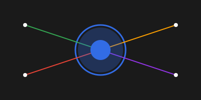

# NEXUS STREAM AI

<div align="center">
  
</div>

Intelligent Real-time Data Orchestration & Analytics

A sophisticated AI-powered data analytics system that bridges real-time data streams with blockchain persistence through intelligent processing. Built on the Daydreams framework, Nexus Stream AI combines intelligent analysis with the Irys datachain, creating a powerful nexus of streaming data, AI insights, and blockchain reliability.

## Core Architecture

### AI Agent Network
- **Multi-Agent System**: Distributed network of specialized AI agents
- **Cross-Agent Learning**: Shared knowledge and continuous improvement
- **Verifiable Computations**: Blockchain-verified AI operations
- **Performance Optimization**: Dynamic resource allocation and load balancing

### Data Processing & Streaming
- **Enhanced Data Streaming**: High-performance stream processing up to 10,000 points/second
- **Adaptive Flow Control**: Dynamic throughput optimization
- **Buffer Management**: Intelligent memory management and caching
- **Pattern Recognition**: Real-time pattern detection and analysis

### Blockchain Integration
- **Irys Integration**: Secure, verifiable data storage
- **State Synchronization**: Consistent state management across the network
- **Proof Generation**: Verifiable computation proofs
- **Data Persistence**: Permanent storage with verification

## Key Components

### Agent Network Architecture
```typescript
interface AgentNode {
  id: AgentId;
  experts: {
    pattern: PatternExpert;
    prediction: PredictionExpert;
    storage: StorageExpert;
  };
  metrics: AgentMetrics;
  status: 'active' | 'learning' | 'validating' | 'inactive';
}
```

### Data Processing System
```typescript
interface ProcessingResult {
  streamId: string;
  patterns: PatternAnalysis;
  predictions: Prediction;
  insights: ProcessingInsights;
  metadata: ProcessingMetadata;
  metrics: ProcessingMetrics;
  storage: StorageInfo;
  verification: VerificationInfo;
}
```

### Cross-Agent Learning
```typescript
interface Knowledge {
  id: string;
  type: KnowledgeType;
  sourceAgent: AgentId;
  timestamp: number;
  data: any;
  metadata: KnowledgeMetadata;
  validation: ValidationResults;
  storage?: {
    txId: TransactionId;
    verified: boolean;
  };
}
```

## Features

### AI Capabilities
- **Pattern Analysis**: Advanced time series analysis with multiple expert systems
- **Predictive Analytics**: Multi-horizon forecasting with confidence metrics
- **Knowledge Sharing**: Cross-agent learning and improvement
- **Verifiable Intelligence**: Blockchain-verified AI computations

### Performance Optimization
- **Dynamic Resource Allocation**: Adaptive resource management
- **Parallel Processing**: Optimized multi-threaded operations
- **Memory Management**: Intelligent caching and buffer optimization
- **Load Balancing**: Distributed workload management

### Data Streaming
- **High-Throughput Processing**: Up to 10,000 data points per second
- **Adaptive Flow Control**: Dynamic rate adjustment
- **Buffer Management**: Circular buffer implementation
- **Error Handling**: Comprehensive error management and recovery

### Quality Assurance
- **Continuous Monitoring**: Real-time performance tracking
- **Quality Metrics**: Comprehensive quality assessment
- **Automated Optimization**: Self-tuning capabilities
- **Issue Detection**: Early warning system for potential problems

## Project Structure

```
nexus-stream-ai/
├── src/
│   ├── core/
│   │   ├── nexus-agent-network.ts
│   │   ├── data-processor.ts
│   │   ├── cross-agent-learning.ts
│   │   ├── verifiable-computations.ts
│   │   ├── agent-quality-assurance.ts
│   │   ├── optimization/
│   │   │   └── agent-performance-optimizer.ts
│   │   ├── streaming/
│   │   │   └── enhanced-data-streaming.ts
│   │   └── integration/
│   │       └── daydreams-irys-integration.ts
│   ├── types/
│   │   ├── stream.ts
│   │   ├── processing.ts
│   │   └── analysis.ts
│   └── components/
├── tests/
└── docs/
```

## Installation

1. Install dependencies:
```bash
npm install @irys/sdk @groq/sdk @daydreams/core @daydreams/extensions
```

2. Environment setup:
```env
GROQ_API_KEY=your_groq_api_key
IRYS_KEY=your_irys_key
NETWORK_ID=your_network_id
```

## Usage

### Initialize Agent Network

```typescript
import { NexusAgentNetwork } from './core/nexus-agent-network';
import { DataProcessor } from './core/data-processor';
import { AgentPerformanceOptimizer } from './core/optimization/agent-performance-optimizer';

const network = new NexusAgentNetwork({
  groqApiKey: process.env.GROQ_API_KEY,
  irysKey: process.env.IRYS_KEY,
  networkId: process.env.NETWORK_ID
});

const agent = await network.deployAgent('analysis');
const processor = new DataProcessor(agent);
const optimizer = new AgentPerformanceOptimizer(agent);
```

### Process Data Streams

```typescript
const result = await processor.processStream(
  stream,
  {
    realtime: true,
    priority: 'high',
    verificationLevel: 'enhanced'
  }
);
```

### Enable Cross-Agent Learning

```typescript
import { CrossAgentLearningNetwork } from './core/cross-agent-learning';

const learningNetwork = new CrossAgentLearningNetwork(irys);
await learningNetwork.shareInsights(agent.id, insights);
```

### Verify Computations

```typescript
import { VerifiableComputation } from './core/verifiable-computations';

const computation = new VerifiableComputation(agent, irys);
const result = await computation.executeAndProve(
  'analysis',
  input,
  { verificationLevel: 'full' }
);
```

## Performance Metrics

- Processing Speed: Up to 10,000 data points/second
- Verification Time: <100ms per computation
- Learning Convergence: <1000 iterations
- Memory Efficiency: Dynamic optimization
- Network Latency: <50ms average

## Security Features

- Verifiable Computations
- Blockchain Storage
- Cross-Agent Validation
- State Verification
- Secure Knowledge Sharing

## Technical Requirements

- Node.js >=18
- TypeScript >=4.5
- Groq API Access
- Irys Network Access
- 16GB RAM minimum
- Multi-core processor

## Development

```bash
# Build project
npm run build

# Run tests
npm test

# Generate documentation
npm run docs

# Performance testing
npm run bench
```

## Contributing

1. Fork repository
2. Create feature branch
3. Implement changes with tests
4. Submit pull request with documentation

## License

MIT License - see LICENSE file

## Acknowledgments

- [Daydreams Framework](https://docs.daydreams.ai)
- [Irys Network](https://irys.xyz)
- [Groq](https://groq.com)
